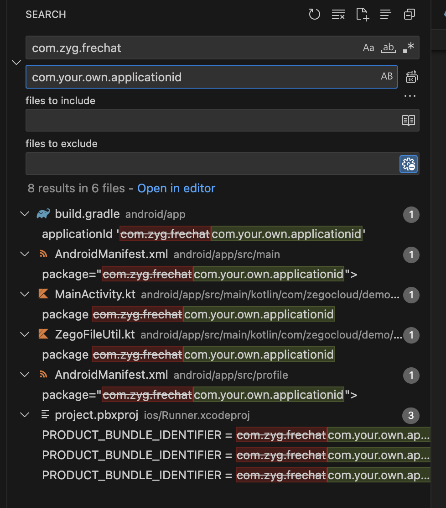
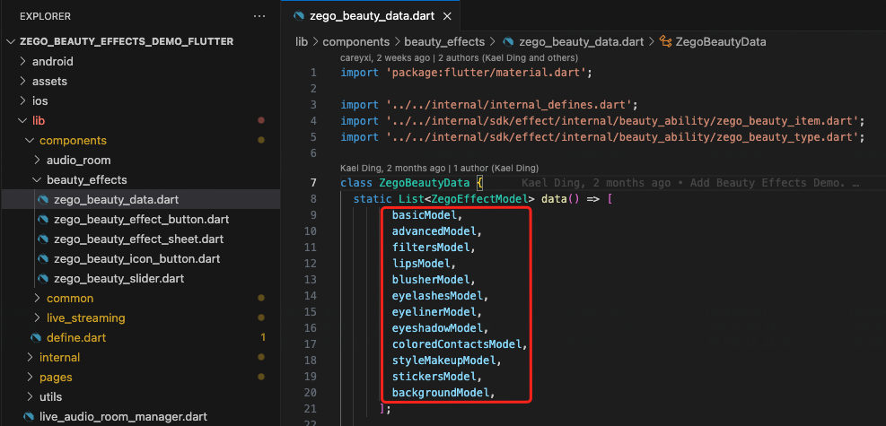

# ZEGOCLOUD & Faceunity

-----

# 1. Run the demo project
## 1.1 Download Demo
Run this command to download the demo

```base
git clone https://github.com/ZEGOCLOUD/zego_beauty_effects_demo_flutter.git -b feature/faceunity --depth 1
```

## 1.2 Use your own faceunity license
  - Replace these files with your authpack.java and authpack.h files.
    
android:`zego_faceunity_plugin/android/src/main/java/com/faceunity/authpack.java`
    iOS: `zego_faceunity_plugin/ios/Classes/authpack.h`
    
  - Fill in your appid and appsign to `lib/zego_sdk_key_center.dart`(serverSecret can be filled in arbitrarily, and it is only used for Flutter web. However, the beauty demo does not support Flutter web.)

## 1.3 Use the applicationID and bundleID corresponding to your license 

you need to globally search and replace them.



## 1.4 Configuration completed, now you can run `flutter run` to start. 

Please use a real device for debugging. The beauty demo does not support simulators.


# 2. How to integrate it into your own project
## 2.1 The code structure of the Demo is as follows.

Before we start, let me introduce the structure of the demo.

```bash
lib
├── components
├── faceunity
├── internal
├── utils
├── zego_sdk_manager.dart
├── live_audio_room_manager.dart
├── zego_live_streaming_manager.dart
├── zego_sdk_key_center.dart
├── main.dart
└── pages
    ├── login_page.dart
    ├── home_page.dart
    ├── audio_room
    └── live_streaming
```

- zego_sdk_key_center.dart - You need to fill in your appid and appsign to this file. (serverSecret can be filled in arbitrarily if you don't need Flutter web).
- `components` - UI components used in the demo.
- `faceunity` - Faceunity's Dart layer encapsulation
- `utils` - App permission management, token generation, and other logic
- `internal` - Best practice encapsulation of ZEGOCLOUD SDK, try not to modify the code here (if there are bug fixes in the demo, we will update it here, and you should strive to keep the code here consistent with our demo to facilitate easier updates).
- `zego_sdk_manager.dart` - You need to initialize the SDK using the init method and call the connectUser method to connect the user when they login. ( Please refer to login_page.dart for specific usage instructions.)
- `zego_live_streaming_manager.dart` - ZEGOCLOUD implements live streaming scenes, including methods such as joining and leaving rooms, co-hosting, PK, etc. Please refer to `pages/live_streaming` for specific usage instructions.
- `live_audio_room_manager.dart`- ZEGOCLOUD implements the scene of a live audio room (voice chat room), including methods such as joining and leaving the room, taking and leaving the seat, locking the seats, and switching seats, etc. Please refer to pages/audio_room for specific usage methods.
- `zego_call_manager.dart`- ZEGOCLOUD implements the scene of a video/audio call, including methods such as joining and leaving the call, switch camera, enable speaker, etc. Please refer to pages/call for specific usage methods.
- `login_page.dart` and `home_page.dart` - You can refer to these two files to see how to initialize the SDK and how to navigate to the live page and chat room page.

## 2.2 Integration guide
### 2.2.1 Copy Dart files into your project

- You need to copy the red part files to your project
- And the blue part is optional:
  - If you need live streaming, you will need `pages/live_streaming` and  `zego_live_streaming_manager.dart`
  - If you need live audio room, you will need `pages/audio_room` and  `live_audio_room_manager.dart`
  - If you need call, you will need `pages/call` and  `zego_call_manager.dart`


### 2.2.2 Copy assets and faceunity plugin to your project

- Copy assets into your project and declare them in the `pubspec.yaml` file. See the red part in the picture. (Due to the usage of some assets in the demo, such as button icons)

- Copy `zego_faceunity_plugin` and use path dependency in your project. See the blue part in the picture.



### 2.2.3 Copy the files of FaceUnity needed

#### 2.2.3.1 Android

- These files need to be copied to `your_projcet/android/app/src/main`
- And declared them in `android/app/build.gradle`


#### 2.2.3.2 iOS (TBD)

### 2.2.4 Use them in your code

#### 2.2.4.1 init sdk and connect user

You need to initialize the SDK using the `init` method and call the `connectUser` method to connect the user when they login. ( Please refer to `login_page.dart` for specific usage instructions.)

You can put this logic in your user's login button, or call these two methods when the user successfully logs in through cache. For example:

```dart
ElevatedButton(
  onPressed: () async {
    await ZEGOSDKManager.instance.init(SDKKeyCenter.appID, kIsWeb ? null : SDKKeyCenter.appSign);
    await ZEGOSDKManager.instance.connectUser(userIDController.text, userNameController.text);
  },
  child: const Text('Login'),
),
```

Tips: You can use the `ZEGOSDKManager` to listen to the underlying events of the Basic SDK and obtain the user connection state. Below is an example code for navigating to the home page when the user successfully connects. ( Please refer to `login_page.dart`. )

```dart
ZEGOSDKManager.instance.zimService.connectionStateStreamCtrl.stream.listen((ZIMServiceConnectionStateChangedEvent event) {
  debugPrint('connectionStateStreamCtrl: $event');
  if (event.state == ZIMConnectionState.connected) {
    Navigator.pushReplacement(
      context,
      MaterialPageRoute(builder: (context) => const HomePage()),
    );
  }
});
```

#### 2.2.4.2 Navigate to the live_page

After ensuring successful user login, you can freely use `ZegoLivePage` at any time.

```dart
  Widget hostJoinLivePageButton() {
    return SizedBox(
      width: 200,
      height: 50,
      child: ElevatedButton(
        onPressed: () {
          Navigator.push(
            context,
            MaterialPageRoute(
              builder: (context) => ZegoLivePage(roomID: roomIDController.text, role: ZegoLiveRole.host),
            ),
          );
        },
        child: const Text('Start a Live Streaming'),
      ),
    );
  }
```

# 3. How to adjust the beauty parameters

- Please read the code in `lib/faceunity/faceunity_manager.dart` and `lib/faceunity/faceunity_button.dart`.
  - Use `FaceunityManager().initFaceunity()` to initialize faceunity.
  - Use `FaceunitySettingButton` to show up the beauty menu.
  - Use `FaceunityManager().setBeautyOption(...)` to modify the beauty parameters.'
  - Use `FaceunityManager().uninitFaceunity()` to deinitialize faceunity.


# 4. more features

If you need to expand more features, please make sure to read the following content to understand the basic operation mechanism and extend the functionality of FaceUnity.

- The specific implementation of the faceunity plugin can be found in `zego_faceunity_plugin/lib/zego_faceunity_plugin.dart` and `zego_faceunity_plugin/android/src/main/java/im/zego/zego_faceunity_plugin/ZegoFaceunityPlugin.java`

- For More faceunity features, please refer to the official documentation of [faceunity](www.faceunity.com).
